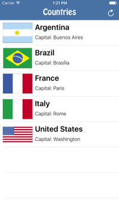
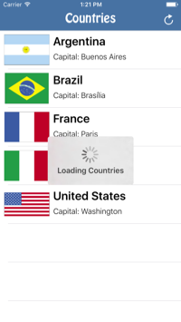
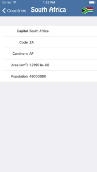
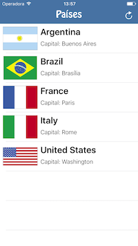
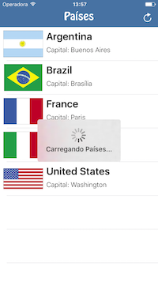
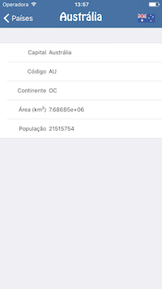

# Countries for iOS
Countries is a simple *master/detail* app that lists Countries of the World. Country data is download from the GeoNames Web-service, which is a public service that provides several kinds of geographical data.

## Features
With this demo code you can learn how to:
* Download JSON data from a public Web Service using [`(NS)URLSession`](https://developer.apple.com/library/ios/documentation/Foundation/Reference/NSURLSession_class/) asynchronously;
* Parse the JSON data into model using [`SwiftyJSON`](https://github.com/SwiftyJSON/SwiftyJSON) Library;
* Download and display images asynchronously using [`SDWebImage`](https://github.com/rs/SDWebImage);

Feel free to Clone/Fork and play around with this demo! :-)

---

# Países para iOS
Países é um app simples do tipo *mestre/detalhe* que lista os países do mundo dando acesso a suas informações e bandeiras. Os dados são obitidos através do web service do GeoNames, um serviço público que fornece dados geográficos de todo o mundo.   

## Características e Funcionalidades
Com esse código demonstrativo você pode aprender a:
* Baixar um conteúdo JSON de um Web Service público usando a classe [`(NS)URLSession`](https://developer.apple.com/library/ios/documentation/Foundation/Reference/NSURLSession_class/) de maneira assíncrona;
* Interpretar um conteúdo JSON usando o componente [`SwiftyJSON`](https://github.com/SwiftyJSON/SwiftyJSON);
* Baixar e exibir imagens e exibir imagens assíncronamente usando o componente [`SDWebImage`](https://github.com/rs/SDWebImage);

Sinta-se a vontade para Clonar/Forkar o repositório e brincar com o demo! :-)